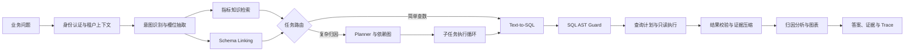

# InsightBI Agent：企业级制造业智能分析系统

InsightBI Agent 面向制造业经营分析场景，将业务人员的自然语言问题转换为安全、可执行、可追溯的数据查询与归因报告。系统不仅支持“最近三个月收入是多少”一类单次查数，也能处理“利润为什么下降”这类依赖多条 SQL、中间证据和业务归因的复杂任务。

项目采用分层语义检索、动态任务规划、受控 SQL 执行和全链路评测设计。所有结论均保留指标口径、字段映射、执行 SQL、查询结果和证据编号，便于业务复核与问题审计。

## 核心能力

- **问题理解与动态路由**：识别业务意图，抽取指标、维度、筛选条件与时间范围，将请求分流为简单查数、复杂归因或澄清追问。
- **指标知识检索**：管理指标别名、计算公式、统计粒度、适用维度、负责人和版本，避免“利润”等业务术语口径不一致。
- **Schema Linking**：从问题中召回相关主题域、表、字段和值，并通过 Join 图搜索连接路径，减少无关表结构进入模型上下文。
- **Plan-and-Execute Agent**：将复杂问题拆成带依赖关系和成功条件的查询步骤，逐步产生证据，并在步骤预算内完成分析。
- **Text-to-SQL**：只基于已召回的指标定义、字段和 Join 关系生成 SQL；模型层采用可替换接口，可接入企业内网模型或兼容 OpenAI 协议的模型服务。
- **SQL 安全治理**：通过 AST 拒绝写操作、多语句、系统库、越权表和高风险函数，自动注入行数上限，并在执行前检查查询计划成本。
- **可靠性控制**：提供幂等键、重复 SQL 哈希检测、步骤预算、超时控制、限流及明确的失败边界，避免 Agent 无限循环和雪崩重试。
- **可审计分析**：Trace 记录用户、意图、检索结果、计划、SQL Guard、执行结果和证据编号；前端可展开查看每条 SQL 与数据证据。
- **分层评测**：覆盖意图路由、指标召回、Schema Linking、SQL 安全、执行正确性和复杂任务证据完整性，测试结果由代码真实生成。
- **工程化交付**：提供 FastAPI、SSE、React、Docker Compose、Prometheus 和持续集成配置，可在本地一键启动。

## 系统架构



指标知识检索与 Schema Linking 在同一阶段并行执行：前者回答“业务指标怎么计算”，后者回答“物理表字段在哪里、怎样连接”。二者共同约束 SQL 生成，但职责和数据版本独立管理。

## 复杂归因链路

以“最近三个月利润为什么下降”为例，系统执行以下步骤：

1. 识别“为什么、下降”为复杂分析信号，抽取利润指标与时间范围。
2. 并行召回毛利润公式、统计粒度，以及收入、成本、产品、日期等字段和 Join 路径。
3. Planner 生成月度趋势、产品贡献、量价本拆解三个带依赖关系的子任务。
4. 每个子任务独立生成 SQL，并重新经过 AST 校验、权限校验、成本检查和只读执行。
5. 查询结果以 `evidence_id` 固化，后续结论只引用已执行证据，不让模型凭空补充数据。
6. 汇总收入变化、成本变化和产品利润变化，生成结论、图表与完整 Trace。

## 安全与权限

- JWT 携带用户、租户、角色、可访问主题域与数据范围；演示环境提供 `demo-token`。
- 语义检索前按主题域裁剪元数据，SQL 生成后再次执行表级权限检查。
- SQL 解析采用 AST，而非仅依赖正则表达式；只允许单条只读查询。
- 拦截 `INSERT`、`UPDATE`、`DELETE`、DDL、系统库和高风险函数。
- 自动添加查询行数上限，执行前通过 `EXPLAIN` 估算扫描风险，执行阶段设置硬超时。
- 幂等键包含租户、用户权限、问题、会话及指标与 Schema 版本，避免不同权限请求错误复用结果。
- 仓库不存储密钥；生产环境必须替换默认签名密钥，并通过密钥管理服务注入模型与数据库凭据。

## 技术栈

| 分层 | 技术与职责 |
|---|---|
| 接口层 | FastAPI、Pydantic、SSE、JWT |
| Agent 编排 | LangGraph 状态图、Plan-and-Execute、步骤预算与依赖校验 |
| 语义层 | 指标注册表、BM25 与向量相似度融合、RRF、Schema Linking、Join 图搜索 |
| 数据层 | SQLAlchemy、SQLite 演示库；接口可替换 MySQL/PostgreSQL |
| 安全层 | sqlglot AST、表级权限、查询计划检查、只读执行与超时 |
| 前端 | React、TypeScript、ECharts，展示答案、趋势、证据与 SQL |
| 可观测性 | 结构化 Trace、Prometheus 指标、证据编号 |
| 工程交付 | Docker Compose、Pytest、Ruff、GitHub Actions |

## 目录结构

```text
insightbi-agent/
├─ backend/
│  ├─ app/
│  │  ├─ agent/           # 状态、路由与执行编排
│  │  ├─ api/             # 查询、流式输出和 Trace 接口
│  │  ├─ core/            # 配置、领域模型与异常
│  │  ├─ db/              # 数据库连接和制造业样例数据
│  │  ├─ knowledge/       # 指标定义与 Schema 元数据
│  │  ├─ llm/             # 可替换的模型服务适配器
│  │  ├─ observability/   # Trace 与 Prometheus 指标
│  │  ├─ retrieval/       # 混合检索、指标 RAG、Schema Linking
│  │  ├─ services/        # 意图、规划、分析、鉴权与幂等
│  │  └─ sql/             # SQL 生成、AST Guard 与只读执行
│  └─ tests/              # 单元测试与端到端链路测试
├─ frontend/              # 可视化查询与证据界面
├─ evals/                 # 黄金问题集
├─ scripts/               # 自动评测脚本
├─ deploy/                # 监控配置
└─ docker-compose.yml     # 本地完整环境
```

## 快速启动

### Docker Compose

```bash
cp .env.example .env
docker compose up --build
```

启动后访问：

- 前端：`http://localhost:5173`
- 接口文档：`http://localhost:8000/docs`
- 健康检查：`http://localhost:8000/health`
- Prometheus：`http://localhost:9090`

### 本地开发

后端：

```bash
cd backend
python -m venv .venv
source .venv/bin/activate
pip install -e ".[dev]"
uvicorn app.main:app --reload
```

Windows PowerShell 激活环境：

```powershell
.\.venv\Scripts\Activate.ps1
```

前端：

```bash
cd frontend
npm install
npm run dev
```

## 接口示例

```bash
curl -X POST http://localhost:8000/api/v1/query \
  -H "Authorization: Bearer demo-token" \
  -H "Content-Type: application/json" \
  -d '{"question":"最近三个月利润为什么下降"}'
```

响应包含：

- `mode`：简单查询或复杂分析；
- `answer`：基于证据生成的业务结论；
- `sql`：实际执行的 SQL；
- `evidence`：字段、数据行、证据编号和步骤信息；
- `charts`：前端可直接渲染的图表规范；
- `trace_id`：用于查询完整执行轨迹；
- `latency_ms`：端到端耗时。

## 模型接入

默认使用确定性语义与 SQL 生成策略，保证在没有模型密钥时仍可运行完整链路与自动测试。真实环境可配置兼容 OpenAI 协议的模型服务：

```dotenv
LLM_PROVIDER=openai_compatible
LLM_BASE_URL=https://your-model-gateway/v1
LLM_API_KEY=your-secret
LLM_SMALL_MODEL=your-routing-model
LLM_LARGE_MODEL=your-reasoning-model
```

推荐将意图识别、Schema 重排和简单 SQL 分配给低延迟模型，将复杂计划与分析报告分配给推理能力更强的模型；当大模型超时或触发预算时，可降级为只返回已验证的数据证据和不完整说明，不能用猜测补齐结论。

## 测试与评测

运行后端测试：

```bash
cd backend
pytest --cov=app --cov-report=term-missing
```

运行黄金问题集：

```bash
python scripts/run_evaluation.py
```

当前评测覆盖：

- 意图与复杂度路由；
- 指标 `Recall@K`；
- 字段召回与 Join 路径；
- SQL AST 安全拦截；
- 查询执行与必要字段检查；
- 复杂任务的证据数量和结论完整性。

评测报告必须由当前代码和固定数据集生成。项目不预置无法复现的准确率、性能或线上业务指标。

## 可扩展方向

- 将内置混合检索替换为 Elasticsearch 与向量数据库，并接入专用 Reranker。
- 将内存幂等与 Trace 存储替换为 Redis、PostgreSQL 和 LangGraph Checkpointer。
- 使用数据网关实现列级脱敏、行级权限和查询审计审批。
- 增加指标版本发布、血缘追踪、歧义澄清和人工反馈闭环。
- 接入 OpenTelemetry、Grafana 和告警平台，完善时延、错误率、Token 成本与队列水位监控。
- 扩充真实业务黄金集，按检索、SQL、执行结果和最终结论分层定位错误。

## 设计原则

1. **语义口径先于 SQL**：先确定指标定义和字段映射，再生成物理查询。
2. **模型负责判断，程序负责约束**：模型参与理解、规划和总结；权限、安全、预算、幂等与终止条件由程序控制。
3. **证据先于结论**：没有通过 SQL 执行得到的证据，就不生成确定性归因。
4. **简单问题走短链路**：避免所有请求进入复杂 Agent，降低延迟和模型成本。
5. **逐层评测**：不能只看 SQL 是否运行，还要分别衡量检索召回、执行结果和最终回答是否正确。

